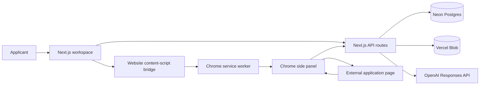

# MeritOS System Guide

This is the interview-ready map of how MeritOS works. Use function and route names as the durable landmarks; line numbers move whenever the UI changes.

## The one-sentence explanation

MeritOS turns user-approved evidence into a reusable profile, discovers relevant opportunities, prepares an application queue, and uses a Chrome side panel to understand and fill legitimate external forms while visibly stopping for unsupported, sensitive, login, CAPTCHA, upload, and final-submit steps.

## Architecture at a glance



## The complete user workflow

### 1. Sign in and create the profile

1. Clerk authenticates the user in `app/layout.tsx` and `app/page.tsx`.
2. `app/page.tsx` loads `/api/profile`, `/api/claims`, `/api/stories`, `/api/applications`, and dashboard data.
3. `finishOnboarding()` saves the applicant's use case, education stage, location, and recurring application context.
4. `/api/profile` writes the account profile; `/api/claims` stores applicant-confirmed facts.

Primary tables: `profiles`, `claims` in `db/schema.ts`.

### 2. Upload evidence and verify facts

1. **Choose document** opens the import modal in `app/page.tsx`.
2. `importDocument()` sends the file to `POST /api/documents`.
3. The route stores private file bytes through `app/api/_lib/storage.ts` and extracts text/facts through `lib/document-facts.ts` and the résumé intelligence helpers.
4. Candidate facts return as `draft`; they do not automatically become verified evidence.
5. **Verify**, **Unverify**, **Restrict**, **Delete**, and category changes call `/api/claims/[id]`.
6. The Chrome extension profile endpoint returns verified claims plus only narrowly allowed, high-confidence identity/contact drafts.

Primary tables: `documents`, `claims`, `audit_events`.

### 3. Find and rank opportunities

1. **Find matching applications** calls `scanOpportunityBoards()` in `app/page.tsx`.
2. That calls `POST /api/opportunity-watch`.
3. The route searches configured public feeds/repositories and, when `OPENAI_API_KEY` exists, `scanLiveWebOpportunities()` searches the live public web for official pages.
4. `lib/opportunity-watch-core.js` expands the field query and scores field relevance separately from applicant level.
5. Explicit applicant-level conflicts are excluded. Unknown audience eligibility stays visible as “needs confirmation.”
6. Results are ranked with target relevance and limited verified-profile overlap.

Key files:

- `app/api/opportunity-watch/route.ts`
- `app/api/extension/discover/route.ts`
- `lib/opportunity-watch-core.js`
- `lib/opportunity-web-search.ts`

### 4. Prepare an application packet

1. **Prepare now** calls `analyzeOpportunityPage()`.
2. `POST /api/opportunity-preflight` fetches the official page and `lib/opportunity-intelligence.ts` extracts requirements, documents, visible questions, deadlines, and AI policy.
3. The opportunity is stored in `opportunities` and an application record is stored in `applications`.
4. `buildApplicationPacket()` calls `POST /api/application-packet`.
5. The packet uses verified evidence to create supported drafts and returns explicit missing inputs for anything unsupported.
6. The user can edit packet answers, download the packet, or open the official form.

### 5. Connect the website to Chrome

1. **Connect Chrome** calls `createExtensionConnection()` in `app/page.tsx`.
2. `POST /api/extension/connect` creates a random token, stores only its SHA-256 hash in `extensionTokens`, and revokes the user's previous active token.
3. The website posts `MERITOS_CONNECT_PROFILE` to its own page.
4. `extension/content.js` accepts the event only from the trusted MeritOS origin and forwards it to the service worker.
5. `extension/background.js` validates the origin, URL, and token shape, verifies the token against `/api/extension/profile`, then stores `meritosToken`, `meritosBaseUrl`, and the cached profile in `chrome.storage.local`.
6. Every side panel reads the same extension-level storage. `extension/sidepanel.js` also listens for storage changes, so the profile and application run stay synchronized across tabs.

Security detail: the plaintext connection token is shown only to the applicant and Chrome. The database stores its hash, not the token.

### 6. Hand selected applications to Autopilot

1. **Start selected in Chrome** calls `handoffSelectedApplications()`.
2. The website posts `MERITOS_QUEUE_APPLICATIONS`.
3. `extension/content.js` forwards the queue to `extension/background.js`.
4. The service worker validates HTTPS URLs, stores `meritosApplicationQueue` and `meritosApplicationRun`, opens the first URL, enables the side panel for that tab, and attempts to open it.
5. `extension/sidepanel.js` restores the shared run and calls `executeApplicationRun()`.

### 7. Get from a landing page to the actual form

1. `extension/content.js` builds `pageState()` from visible links, buttons, password fields, form controls, and JSON-LD application URLs.
2. `extension/navigation-core.js` classifies the page as `landing`, `login`, `captcha`, `form`, `ats_waiting`, or `unknown`.
3. On a landing page, `applicationEntry()` and `chooseApplicationLink()` prefer direct official/ATS apply links.
4. The service worker or `executeApplicationRun()` opens that URL. If the site blocks scripted navigation, `MERITOS_GUIDE_ACTION` highlights the exact Apply control.
5. On a sign-in/account page, the content script detects password/account controls even though they are technically form fields. MeritOS outlines the exact **Create account** or **Sign in** control and pauses.
6. When the site changes to the application form, the content script reports the new state and the stored run resumes automatically.
7. CAPTCHA or human verification is never bypassed.

Key files:

- `extension/navigation-core.js`
- `extension/content.js`: `pageState()`, `showGuidance()`, `detectAndLaunch()`
- `extension/background.js`: `MERITOS_APPLICATION_ENTRY_DETECTED`
- `extension/sidepanel.js`: `executeApplicationRun()`

### 8. Scan, understand, and fill a form

1. `extension/content.js` scans DOM/accessibility controls and normalizes text, date, number, select, radio, checkbox, contenteditable, and embedded-frame fields.
2. `scanStable()` makes several passes so dynamically loaded questions are not missed.
3. `extension/sidepanel.js` asks `extension/intelligence.js` for deterministic identity/evidence mappings.
4. Narrative and ambiguous fields go to `POST /api/extension/draft`, which calls `lib/ai-drafting.ts`.
5. The AI receives only relevant allowed evidence IDs, the exact question, its answer options, and official page context.
6. Safe supported answers preselect. Inferences remain individually reviewable. Medium/low-confidence open-text fields can show up to two evidence-grounded alternatives.
7. The applicant can edit any suggestion before clicking **Fill ready answers**.
8. `MERITOS_FILL_MANY` writes supported values into the external form and dispatches input/change events.
9. Missing required fields and inferences are highlighted on the original page. File uploads remain manual.
10. Safe Next/Review actions may continue automatically, but final Submit is never pressed.

## Button-to-code reference

| Button or action | Frontend/extension handler | Server/business logic | Persistent data |
|---|---|---|---|
| Finish setup | `finishOnboarding()` in `app/page.tsx` | `/api/profile`, `/api/claims` | `profiles`, `claims` |
| Extract facts | `importDocument()` | `/api/documents`, `lib/document-facts.ts` | `documents`, `claims`, Blob |
| Verify / Restrict / Delete | `changeClaimStatus()`, `deleteClaim()` | `/api/claims/[id]` | `claims`, audit events |
| Import website / LinkedIn | `importContextSource()` | `/api/context-url` | draft `claims` |
| Analyze my fit | `runFitAnalysis()` | `/api/fit-analysis`, `lib/profile-intelligence.ts` | `fit_analyses` |
| Have MeritOS create a starter | `buildGapArtifact()` | `/api/gap-artifact` | saved only if user adds it |
| Find matching applications | `scanOpportunityBoards()` | `/api/opportunity-watch`, watch core, live web search | browser state until prepared |
| Alert me | `toggleOpportunityAlerts()` | website → content script → worker alarm → `/api/extension/discover` | Chrome local storage |
| Prepare selected | `prepareSelectedApplications()` | `/api/opportunity-preflight`, `/api/application-packet` | `opportunities`, `applications` |
| Start selected in Chrome | `handoffSelectedApplications()` | website bridge → service worker queue | Chrome local storage |
| Generate grounded story | `generateStory()` | `/api/stories` | `stories` |
| Start practice | `generateInterview()` | `/api/interview` | `interview_sessions` |
| Get feedback | `evaluateAnswer()` | `/api/interview` | response/session state |
| Connect Chrome | `createExtensionConnection()` | `/api/extension/connect` → website bridge → worker → `/api/extension/profile` | `extension_tokens`, Chrome local storage |
| Find (side panel) | `searchApplicationRuns()` | `/api/extension/discover` | side-panel result state |
| Start selected (side panel) | `startApplicationRun()` | side panel + service worker navigation | Chrome run/queue storage |
| Refresh answers | `scan()` | DOM scan + `/api/extension/draft` | side-panel state |
| Improve / Try another answer | `generateDrafts()` | `/api/extension/draft` | side-panel state |
| Fill ready answers | fill handler in `extension/sidepanel.js` | `MERITOS_FILL_MANY` in `extension/content.js` | external form values only |
| Resume | `resumeApplicationRun()` | `executeApplicationRun()` | Chrome run storage |
| End | `stopApplicationRun()` | stops active run | Chrome run storage |

## Data ownership and trust boundaries

- Clerk session proves who can access the web workspace.
- Extension tokens connect Chrome to one MeritOS profile without sharing Clerk cookies with arbitrary application websites.
- External pages are untrusted. Their text can describe an opportunity but cannot redefine MeritOS instructions.
- Canonical claims are separate from generated answers.
- Only verified claims (plus narrowly allowed high-confidence identity/contact drafts) reach the extension profile.
- Inferences are labeled; sensitive, third-party, consent, legal, demographic, and work-authorization answers are not guessed.
- No automatic final submission.

## How to find any code path yourself

From the project root in PowerShell:

```powershell
# Find the UI label
git grep -n "Fill ready answers"

# Find the handler or message
git grep -n "MERITOS_FILL_MANY"

# Find every caller of an API route
git grep -n 'api/opportunity-watch'

# Find the database table definition
git grep -n "export const extensionTokens" db
```

Use this tracing rule every time:

**button text → React/side-panel handler → fetch or Chrome message → API/service-worker receiver → domain helper → database/storage write → UI response**.

## Three-page navigation test

Run the deployed workflow in this order:

1. `/extension-navigation-test.html` — MeritOS should identify and highlight **Apply now**.
2. `/extension-login-fixture.html` — it should treat the password/account screen as a login wall, not as an application form, and highlight the account action.
3. `/extension-form-fixture.html` — it should detect eight fillable questions, including date, radio, number, file, and dynamically inserted phone controls. It may fill supported controls but must leave the file upload and final Submit to the applicant.

## Known limits you should state honestly in an interview

- Search coverage is broad, not literally every opportunity on the internet.
- Some sites block automation, hide forms in inaccessible frames, or require human login/CAPTCHA.
- Eligibility can be confirmed only when the official listing states it.
- AI drafts are constrained by evidence but still require review.
- Browser guidance does not bypass anti-bot controls or submit on the user's behalf.
